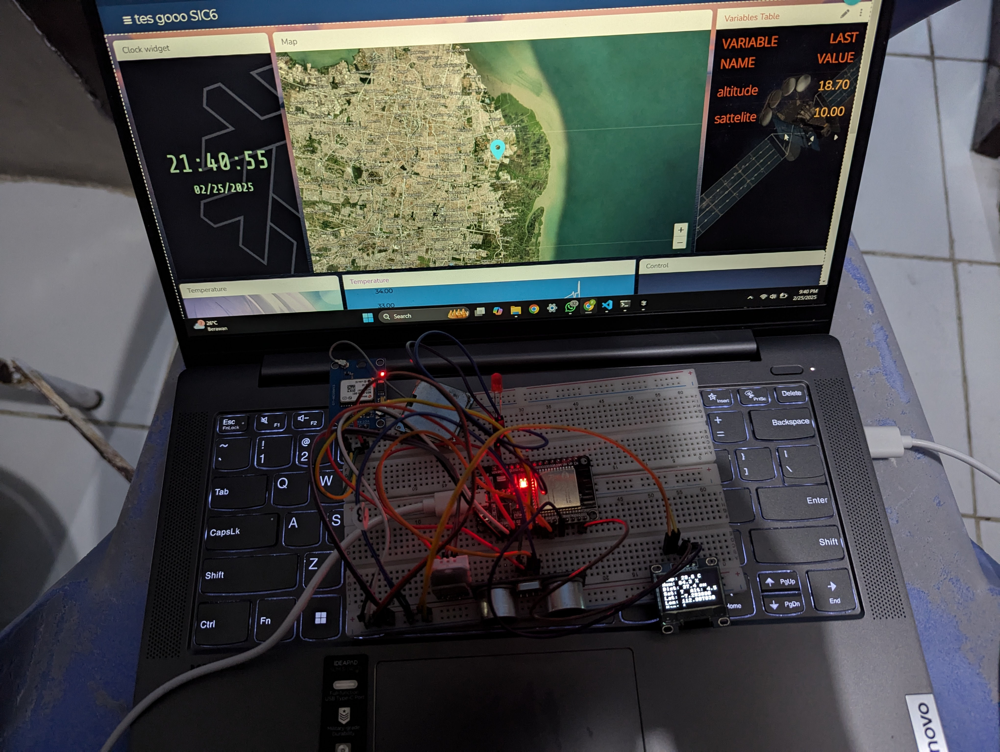
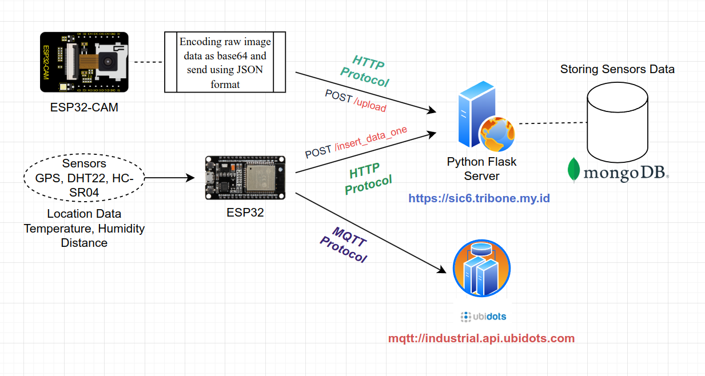
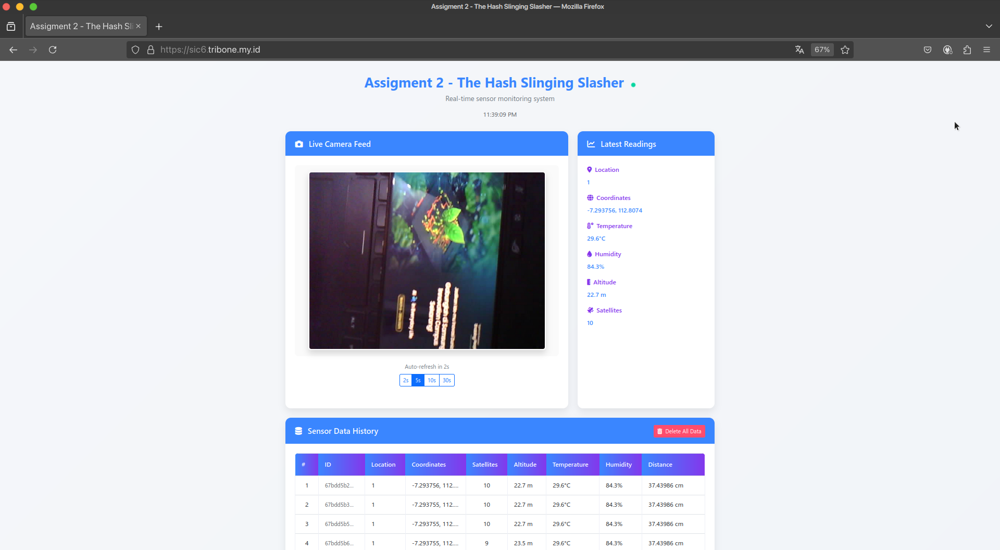
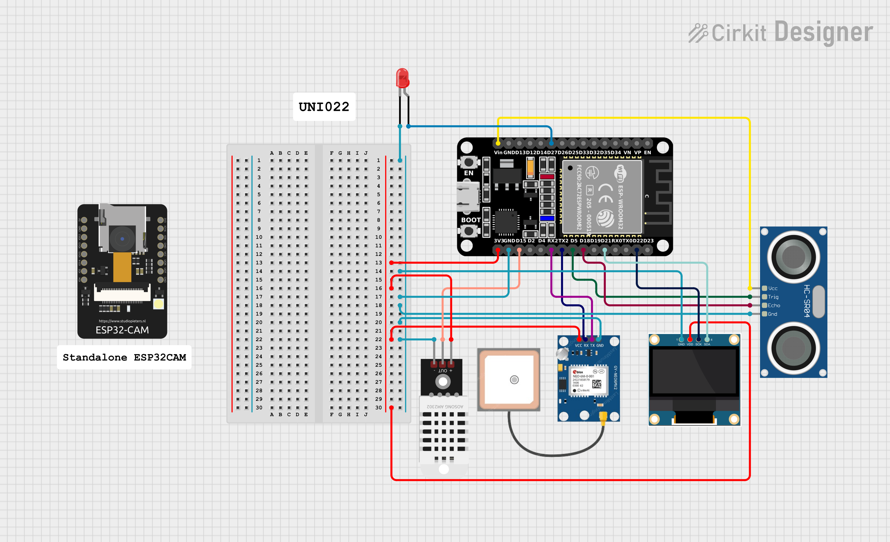

# ESP32 Micropython Ubidots Project ✨
<div align="center">
<p align="center">
<a href="/docs/banner.png"></a><br>

[](https://forthebadge.com) 

 

[![PENS - UNI022](https://img.shields.io/badge/PENS-UNI022-2ea44f?logo=data:image/png;base64,iVBORw0KGgoAAAANSUhEUgAAAYcAAAF0BAMAAAA6Nuj6AAAABGdBTUEAALGPC/xhBQAAAAFzUkdCAK7OHOkAAAAPUExURUdwTP///////////////xPgMRoAAAAEdFJOUwD7/vw0NoivAAAACXBIWXMAAA7DAAAOwwHHb6hkAAAHT0lEQVR42u2dS5YlKQiGHbCC3knv4B+4/zV11elzOm9nRSgvEU0Y1tUIPwFFMLJaKykpKSkpKSkpKSn5lP6v4FwC6p9yAcKR6vgD4UBlPDIcRvHCcBTFK8NJFO8M53j3QBHnqGLEcIwqhhD9AmsqiIIoiEPX2PshTtknrtixr4id7ohirzhP3HGye/GLynZkwDgT4ZPjtDkX6QdpfVjm8FmXIbi13hlhwKv51p1ZGlSljC4gjalSBqvHRLfiow/lOyzJD6GU7sg3ZngckqLLVoanIU27JEvLPIxJ3iMDw+ewhM2TGJNScAFDpCpoHQQuUEScKmglBC5QRJQqaC0ELlBEkCpWQyCbNUHfJwmET7+t1qTvmgbCokXkgMCi3pEQRpfKAAHrwpABYvUsREAg4Ak7shxCg1oEQR924jCAHZc/6H8j9EjjkSy54Gs/mAwAHkaJP5rA1wfG74eLaz01gI8pMVThs0A8B76ua9HAojGeADAd4+XFcFxPB749GyQvOfv6m+OegNdJxHyeGRgDPsfzz+svHJPnrBvOEJPvOEbvIMn69fQEt518Ooz3uwHm3dhrK2fMJePfdQPxui5FMghuVIFQCM4gnu+lONQXnWJD1r5Mj0NzSGY4ReldDTE9fzoEVtZgeQrRV0LARRH9uZlrIsDpxEQrIbr+5SJVcB/CCxhkI/FKcpIUAjKIvjYTwT48vkFwk99QJ2sdsvdeEONY0EEVXQyhrSOtq19QHMTX40jRR+1ZzhCrSpNUED0HhaA/ZYWgAyBgUwTug+ibILrNmpJAwFQIemmMYIjuB0FJIcgKQRajcLKnrnKJDzgyTWcSCOs9Xg970lmTwimgvzYxgyA7BFmtgaz2pLUmqVNYr8CshmjmVd46D1prkjmFMfSZQIhc4nVgy88045kgtTUJcoD2I/L4MXpr4vu2040k+QeJzLKcPPlmMSgHa6KuoniaNGUy0OFkOm5CnHmYjGgJBKc+CkEN1xoNwgqhy+hh+C74QLDVp2olcCmFeYvzl6RqJnApRQpMCkH2nDWzM3lDeG7IxO3tDAGjv3FfJFCFfHHyLFMLhuYKAXM4oPRXqc6J8WRLjKyKMx0hIDiuwBrbQToo4TUC+wG6Sb89cIOQKMIBoquWY+7NGvKAkLqVE4RMER65DP0NLvJRRDdbE1MVIgihIowVEL4qVPcvKRCiayFm8bFP3p0UzzBDaG5f2Bk4y6wAQlXIgplhvm8LztiqEpDyFC/zbf4rmhJCHmKKc3XshUN6t2+MYelPbAjSJQccTmny7tw1HM2gCMOywDpvMxdANDuESUZTDN52arOFFRDEDdBeSLdA4HV4vIKZbWFZpYr/JrOpZA8EmqdQQXjak0F6QeSwJyqIJPZ0BUT/0RBmZWIzhMtTtkJ4PWcjBPxWiF0Q8JyPTRBw1eqebcJ509kCEazXJRDu1rkBwt/H4iEWrBThEFig23CIFYs2gvcJrLDQaIjNJuoCgRUT4xh2kPp174CUEUKUY19ko67XMWYVG7+LIr4GLCsA+l3Z8YQQlpPZqohMPIHZQawK15Syoabz3pBSQfAVByFFXG5fggyjr61ShUxtIjP1rbIMVCFdBdRtF6pCfPtB4BZoMRSK7Z2P3FoIhWZjBLc9FkAQ6y0kDiUiFdFG91dM23CgIr5Ps+PRgwIV8TVv3odACmbwODqDAd+yQ0yPgcv8wfP4j/EMbEXYkIjZCJH6/5redAmoIFZXYwpiuTUltif6aRC9IHK4xCUQKIgcLnEHRC+IHC5REAXhCoGCKIiCKIiCKIiCKIiCKIiCKIirICrbURCVAbR4dkEUhKNTtILIAZHVmu6oY7cLrOnH3e3Ia00/7b5TYoY7rs+1C6xpwxelG+0pN0S7wJosHwwfpgqkh6ALFCH/puhMVbR2vipwBARdoAjRfzp/pipOYRhStHPkBobwjxgjKdppcr4eHr27HSmnq+G7NlpJSUlJSUlJSUlJSUlJScnq4/dTPoRiUrk0To3RLI1JozFu/YOfs9+/BjFM1lIIBM3yxbMaCw1HGVKhmWbuaTaM4e8UAjGrodCs3DWuwoRYE80qclOI8e+7FTG16dlU//49xK1nxVFaBYEWY02/IabF+K4TtDAIeEFgZbzQuRB46ZjhYhcb4k2FL0UL2gGBFzZ6HcS3BhjbaQQE2sRaphATHUeE0G1iLZgZIjJCzP848awBRUOgIDgQyAMh2cwoesOOh/A0MRlE94XADRBeFCKI7g3RT4FALgjSQay/CBkA0VJBdCUE3QAx6HkShCTwPAii7YKQnaoKoiAKIh/EPFFwAMT3LKUzRMg+0RdD9AUQjHwxlBC/5O+/1sbiND17zQ4DpkNRFMSscHgARFsLgSCIxvs5MQRugGAkavJkO4YTtQ4CERBtlrw05p1aAITNuilID4J7PN4QKypF07dk/vyUnDVbEAVREAVREAVREAVREAURBtEKIgcEboBoF0C0kpKSkpKSkpKfKf8A7GhImJes5C4AAAAASUVORK5CYII=)](https://github.com/riskyprsty/sic6_assignment) [](https://github.com/riskyprsty/sic6_assignment)

<center>
<b>ESP32 + ESP32CAM Ubidots Micropython Monitoring Projects</b><br>
This project is an assignment for Samsung Innovation Campus Batch 6 (SIC 6)<br><br>
<b>Developed with </b> ❤️ by <b>The Hash Slinging Slasher Team</b> at <br>
</center><br><br>
</p>
</div>

<details>
  <summary>Table of Contents</summary>
  <ol>
    <li>
      <a href="#dashboard-links">Dashboard Links ✨</a>
      <ul>
        <li><a href="#monitoring-dashboard-url">📌 Monitoring Dashboard URL</a></li>
        <li><a href="#ubidots-dashboard-url">🌐 Ubidots Dashboard URL</a></li>
      </ul>
    </li>
    <li>
      <a href="#about-the-project">About The Project</a>
      <ul>
        <li><a href="#concept">Concept</a></li>
        <li><a href="#project-structure">Project Structure</a></li>
      </ul>
    </li>
    <li>
      <a href="#dashboard-screenshot">Dashboard Screenshot 📷</a>
      <ul>
        <li><a href="#monitoring-dashboard-website">Monitoring Dashboard Website</a></li>
        <li><a href="#ubidots-dashboard">Ubidots Dashboard</a></li>
      </ul>
    </li>
    <li>
      <a href="#flask-server-api-documentation">Flask Server API Documentation</a>
      <ul>
        <li><a href="#base-url">Base URL</a></li>
        <li><a href="#upload-image">Upload Image</a></li>
        <li><a href="#insert-single-data">Insert Single Data</a></li>
        <li><a href="#insert-multiple-data">Insert Multiple Data</a></li>
        <li><a href="#delete-all-data">Delete All Data</a></li>
      </ul>
    </li>
    <li>
    <a href="#usage">Usage</a>
          <ul>
        <li><a href="#diagram">Diagram</a></li>
        <li><a href="#wiring">Wiring</a></li>
      </ul>
    </li>
  </ol>
</details>

## Dashboard Links ✨
### 📌 Monitoring Dashboard URL : 
<b>https://sic6.tribone.my.id</b><br>

### 🌐 Ubidots Dashboard URL : <br>
<b>https://stem.ubidots.com/app/dashboards/public/dashboard/jF07t8gcQSrJqPXWmpCxxpuVLqKNBSLNvRhIn_x-I8A</b>

# About The Project

<div align="center">
<p align="center">
<a href="docs/project.jpg"></a><br>

This project is an assignment for the Samsung Innovation Campus (SIC) Batch 6 created by the team <b> UNI022 - The Hash Slinging Slasher.</b> 
This project is an IoT project that connects microcontroller devices with the Ubidots platform. It utilizes the ESP32 connected to several sensors, including the <b>ESP32 CAM</b>, to transmit live <b>video feeds in real-time</b> to the Ubidots dashboard.

This IoT system also integrates several communication protocols simultaneously, such as <b>MQTT to connect with the Ubidots platform</b> and the <b>HTTP protocol to connect to the Rest API created with Python Flask</b>. In addition to sending data to Ubidots, the microcontroller also sends data to the Rest API for data logging, which is then stored in the <b>MongoDB database.</b>
</p>
</div>

## Concept



## Project Structure
```
/docs # Contains project documentation
└── ....
/esp32 # Contains ESP32 micropython source code
├── lib/ # External libraries
├── boot.py
└── main.py
/esp32cam # Contains ESP32CAM micropython source code
├── lib/ # External libraries
├── boot.py
└── main.py
/flask_server # Contains Flask Server source code
├── templates/ # Contains HTML Pages for sic6.tribone.my.id
├── server_forwarder.py # Obsolete forwarder server for ESPCAM (not used)
└── server.py # Main source code for Flask Server
```

## Dashboard Screenshot 📷
### Monitoring Dashboard Website

Accessible via <b>https://sic6.tribone.my.id</b><br>

### Ubidots Dashboard
<div align="center">
<p align="center">
<a href="/docs/banner.png"></a><br>
</p>
</div>

Accessible via
<b>https://stem.ubidots.com/app/dashboards/public/dashboard/jF07t8gcQSrJqPXWmpCxxpuVLqKNBSLNvRhIn_x-I8A</b>

## Flask Server API Documentation
#### Base URL
```bash
http://sic6.tribone.my.id
```

### Upload Image    
#### Endpoint
```bash
POST http://sic6.tribone.my.id/upload
```
#### Description
Receives a base64-encoded image from an ESP32-CAM and saves it as esp32cam.jpg.
#### Request Example
```json
{
  "image": "/9j/4AAQSkZJRgABAQEAAAAAAAD..."
}
```
#### Response Example
Success (200)
```json
{
  "message": "Gambar diterima!"
}

```
Error (400)
```json
{
  "error": "No image received"
}

```

### Insert Single Data
#### Endpoint
```bash
POST http://sic6.tribone.my.id/insert_data_one
```

#### Description
Inserts a single data into MongoDB
#### Request Example
```
{
    "data_sensor": {
        "location": {
            "value": var,
            "context": {
                "lat": lat,
                "lng": lon
            }
        },
        "satellite": {
            "value": sat
        },
        "altitude": {
            "value": alt
        },
        "temperature": {
            "value": temp
        },
        "humidity": {
            "value": hum
        },
        "distance": {
            "value": dist
        }
    }
}
```
#### Response Example
Success (200)
```json
{
  "message": "Data berhasil dimasukkan ke database",
  "inserted_id": "...."
}


```
Error (400)
```json
{
  "error": "Invalid JSON format"
}
```
### Insert Multiple Data
#### Endpoint
```bash
POST http://sic6.tribone.my.id/insert_data_many
```

#### Description
Inserts multiple data into MongoDB

#### Request Example
```
{
    "data_sensor_1": {
        ......
    },
    "data_sensor_2": {
        ......
    },
    ...
}
```
#### Response Example
Success (200)
```json
{
  "message": "Data berhasil dimasukkan ke database"
}

```
Error (400)
```json
{
  "error": "Invalid JSON format"
}
```

### Delete All Data
#### Endpoint
```bash
GET http://sic6.tribone.my.id/delete_all_data
```

#### Description
Deletes all data from MongoDB Collection

#### Response Example
Success (200)
```json
{
  "message": "Data berhasil dihapus"
}

```

## Usage

### Diagram


### Wiring

| GPS NEO 6M     | ESP32       |
| ------------- | ------------- |
|  VCC          |  `3.3V`       |
|  RX          |  `TX2 (GPIO 17)` |
|  TX          |  `RX2 (GPIO 16)` |
|  GND          |  `GND`         |

| HC-SR04    | ESP32       |
| ------------- | ------------- |
|  VCC          |  `VIN`       |
|  TRIG          |  `GPIO 5` |
|  ECHO          |  `GPIO 18` |
|  GND          |  `GND`         |

| DHT22    | ESP32       |
| ------------- | ------------- |
|  VCC          |  `3.3V`       |
|  OUT          |  `GPIO 15` |
|  GND          |  `GND`         |

| OLED   | ESP32       |
| ------------- | ------------- |
|  Vin          |  `3.3V`       |
|  SCL          |  `GPIO 22` |
|  SDA         |  `GPIO 21` |
|  GND          |  `GND`         |